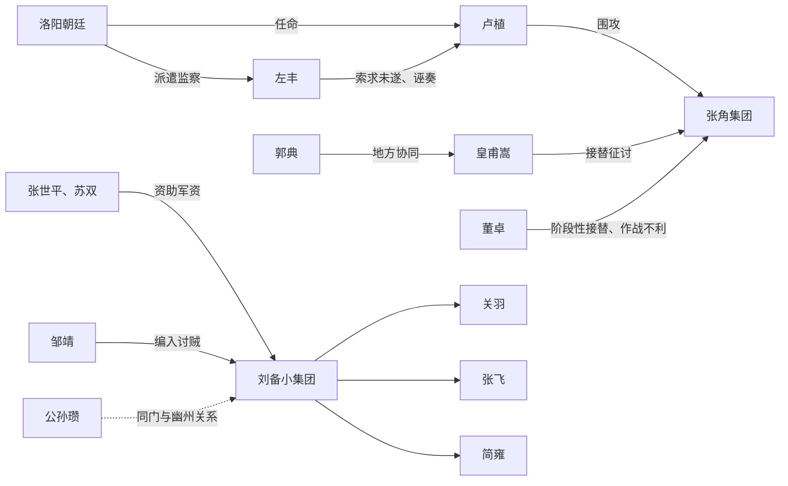

# 首批50名历史人物（184年原型导向）

## 1. 选人标准

这不是“三国名将人气榜”，而是首个历史模拟切片所需的人物网络：

- **P0：实装登场**——184年涿郡—广宗走廊中能够见到、追随、交涉或对抗。
- **P1：远程存在**——通过诏令、军报、传闻、市场和势力状态影响原型区域。
- **P2：预留接力**——184年未必直接出现，但188—190年事件链需要提前记录关系与履历。
- 人物当时身份优先于后世最高官职；不能把190年后的形象提前套在184年人物身上。
- 生卒年、籍贯和官职存在争议时，数据字段允许“不详”“约”“最迟见于”。

史料标记沿用历史事件索引：A为正史核心事实可互证，B为正史有载但细节待校，
C为文学或玩法层内容。

## 2. 首批名单

| ID | 人物 | 184年前后身份/组织 | 主要活动区 | 原型层级 | 游戏功能 | 史实注意 |
|---|---|---|---|---|---|---|
| C001 | 刘备 | 涿郡地方人物、后参与募兵 | 涿郡、幽州战区 | P0 | 小型队伍首领、可投效对象 | 勿预设其已是成熟君主 |
| C002 | 关羽 | 刘备亲近伙伴 | 涿郡及幽州战区 | P0 | 武艺、护卫、关系事件 | 184年前经历记载简略 |
| C003 | 张飞 | 涿郡人、刘备亲近伙伴 | 涿郡及幽州战区 | P0 | 武艺、乡里资源、募兵 | “屠户”等通俗设定不可当正史 |
| C004 | 简雍 | 刘备同乡故旧 | 涿郡 | P0 | 游说、传信、地方关系 | 早期具体年份不详，标B |
| C005 | 邹靖 | 幽州军官 | 幽州 | P0 | 官军任务发布、义兵编组 | 《先主传》载刘备随其讨贼 |
| C006 | 张世平 | 中山大商人 | 涿郡及北方商路 | P0 | 军资投资、商队、买马 | 与苏双“赀累千金”资助刘备 |
| C007 | 苏双 | 中山大商人 | 涿郡及北方商路 | P0 | 军资投资、商队、买马 | 名或作苏双，录异文 |
| C008 | 公孙瓒 | 涿郡相关军政人物 | 幽州、辽西方向 | P0 | 骑兵、边地关系、同门线 | 184年具体任务需谨慎虚构 |
| C009 | 卢植 | 北中郎将、经学名士 | 广宗战区、洛阳 | P0 | 官军统帅、士人导师 | 因拒绝行贿等被槛车征还 |
| C010 | 张角 | 太平道首领、黄巾领袖 | 冀州、广宗 | P0 | 危机核心、宗教网络 | 184年病死；不简单写成妖人 |
| C011 | 张梁 | 黄巾首领，人公将军 | 广宗 | P0 | 后期战役统帅 | 为皇甫嵩所破 |
| C012 | 张宝 | 黄巾首领，地公将军 | 下曲阳 | P0 | 战役统帅、残部网络 | 下曲阳败亡 |
| C013 | 皇甫嵩 | 左中郎将 | 颍川、广宗、下曲阳 | P0 | 战役推进、军纪与招降 | 后接替冀州方向指挥 |
| C014 | 董卓 | 东中郎将等 | 广宗方向 | P0 | 官军派系、失败与问责 | 不能提前采用189年权臣状态 |
| C015 | 郭典 | 钜鹿太守 | 钜鹿、下曲阳 | P0 | 地方守备、军政接口 | 与皇甫嵩等平张宝 |
| C016 | 傅燮 | 官军将领、谏臣 | 冀州及后续凉州线 | P0 | 军务、谏言、士人声望 | 后于汉阳战死 |
| C017 | 赵忠 | 中常侍 | 洛阳 | P1 | 宫廷派系、诏令阻力 | 与卢植案等事件可关联 |
| C018 | 左丰 | 小黄门/使者 | 广宗、洛阳 | P0 | 监察、索贿、政治事件 | 卢植被征事件关键人物 |
| C019 | 汉灵帝刘宏 | 皇帝 | 洛阳 | P1 | 全局政策、财政、任命 | 不作为普通可交互NPC |
| C020 | 何进 | 大将军 | 洛阳 | P1 | 中央军政、募兵政策 | 189年政变核心 |
| C021 | 张让 | 中常侍 | 洛阳 | P1 | 宦官派系、宫廷情报 | 避免把“十常侍”做成同质反派 |
| C022 | 曹节 | 中常侍 | 洛阳 | P1 | 宦官集团资深人物 | 181年去世，仅用于前史关系 |
| C023 | 吕强 | 中常侍、直谏者 | 洛阳 | P1 | 宫廷内部异议 | 184年被诬自杀，展示宦官并非一体 |
| C024 | 封谞 | 宫廷宦官 | 洛阳 | P1 | 太平道京师内应事件 | 与徐奉等涉马元义案 |
| C025 | 徐奉 | 宫廷宦官 | 洛阳 | P1 | 太平道京师内应事件 | 具体处置待校 |
| C026 | 马元义 | 太平道骨干 | 荆、扬、洛阳 | P1 | 秘密运输、联络、告密链 | 起事前被捕并处死 |
| C027 | 唐周 | 太平道成员、告密者 | 洛阳 | P1 | 密探与背叛事件 | 名字异体与身份细节待校 |
| C028 | 皇甫规 | 已故名将、皇甫嵩叔父 | 凉州、洛阳 | P2 | 家族声望、导师前史 | 168年去世，只作关系节点 |
| C029 | 朱儁 | 右中郎将 | 颍川、南阳 | P1 | 官军统帅、战役与招抚 | 184年主要在南方战区 |
| C030 | 曹操 | 骑都尉 | 颍川 | P1 | 官军支线、早期政治评价 | 不提前赋予魏王体系 |
| C031 | 孙坚 | 佐军司马等 | 淮泗、颍川、南阳 | P1 | 募兵、攻城、勇将成长 | 随朱儁作战 |
| C032 | 陶谦 | 官军将领 | 徐州及皇甫嵩军 | P1 | 徐州关系、军政履历 | 参与讨黄巾细节待逐条校核 |
| C033 | 王允 | 豫州刺史 | 豫州 | P1 | 查案、士人政治、黄巾余波 | 后与宦官冲突 |
| C034 | 波才 | 颍川黄巾将领 | 长社、阳翟 | P1 | 颍川战区首领 | 曾围皇甫嵩，后败 |
| C035 | 彭脱 | 汝南黄巾将领 | 西华 | P1 | 汝南战区首领 | 为官军追击击破 |
| C036 | 卜己 | 黄巾将领 | 东郡、仓亭 | P1 | 河济战区首领 | 败于皇甫嵩等 |
| C037 | 张曼成 | 南阳黄巾首领 | 宛、南阳 | P1 | 南阳起事核心 | 杀南阳太守褚贡，后被秦颉杀 |
| C038 | 赵弘 | 南阳黄巾继任首领 | 宛 | P1 | 宛城攻防阶段首领 | 张曼成死后统众 |
| C039 | 韩忠 | 南阳黄巾继任首领 | 宛 | P1 | 谈判、突围、军纪冲突 | 投降与被杀过程适合多结局 |
| C040 | 孙夏 | 南阳黄巾继任首领 | 宛、西鄂 | P1 | 南阳战役尾声 | 为朱儁追击 |
| C041 | 秦颉 | 南阳太守 | 南阳 | P1 | 地方官军、守土与复仇 | 参与击杀张曼成 |
| C042 | 褚贡 | 南阳太守 | 宛 | P2 | 受袭前史、地方官府关系 | 起事初被张曼成所杀 |
| C043 | 刘陶 | 谏臣 | 洛阳 | P1 | 上书、调查、士人网络 | 曾警告张角等问题 |
| C044 | 杨赐 | 太尉等、经学名臣 | 洛阳 | P1 | 士人举荐、宫廷谏议 | 亦曾预警张角势力 |
| C045 | 蔡邕 | 文士 | 洛阳及流寓地 | P2 | 学术、碑刻、声望与流放 | 184年所在地和状态须按月校核 |
| C046 | 刘焉 | 宗室、官员 | 洛阳，后益州 | P2 | 州牧制度与益州线 | 188年以后成为关键人物 |
| C047 | 刘虞 | 宗室、地方长官 | 幽州相关 | P2 | 招抚、边政、民望 | 188年任幽州牧 |
| C048 | 张纯 | 地方军政人物 | 右北平、中山 | P2 | 187年幽州叛乱 | 184年仅作关系伏笔 |
| C049 | 张举 | 地方人物、张纯同盟 | 幽州 | P2 | 187年幽州叛乱 | 后自号“天子” |
| C050 | 丘力居 | 乌桓首领 | 辽西、幽州边地 | P2 | 部族外交、骑兵与边贸 | 与张纯之乱相关 |

## 3. P0原型人物关系网

这张关系网提供六类不依赖君主身份的入口：

- 受商人资助、护送马匹和武器。
- 以乡勇身份受邹靖编组。
- 以县吏身份核对户籍、征募与治安。
- 以士人身份进入卢植的门生或文书关系。
- 以密探身份调查左丰、太平道或地方豪强。
- 以医者、农户身份处理伤兵、难民和宗教互助。

## 4. 人物表现约束

### 4.1 不提前“完成角色”

- 184年的刘备是刚形成小集团的地方人物，不拥有蜀汉君主资源。
- 184年的曹操是官军骑都尉，不拥有成熟的魏国文武班底。
- 184年的孙坚是随军成长的地方武人，不控制江东。
- 184年的董卓是边军将领，尚不是控制洛阳的权臣。
- 关羽、张飞的能力可以突出，但官职、声望和社会关系必须从低位成长。

### 4.2 不把派系写成善恶标签

- 黄巾阵营同时包含宗教救助者、受压迫农户、机会主义者和暴力首领。
- 官军同时包含守土官员、职业军人、被征乡勇、贪吏和趁乱豪强。
- 宦官不是单一人格；吕强与张让、赵忠应表现出不同政治选择。
- 商人资助军队既可能是义举，也可能是风险投资、地方自保或关系经营。

### 4.3 关系必须可继承

人物死亡后，恩义、仇恨、债务、门生关系、官府档案和商业契约不会清零，而是传给：

- 子女与宗族；
- 故吏、门生和部曲；
- 商号、工坊或宗教组织；
- 玩家家族的下一代。

## 5. 首批需要补充的生成角色

历史人物只负责历史锚点。原型仍需约50个生成或半固定角色模板，包括：

- 涿县县令、县丞、功曹、游徼、亭长、书佐；
- 马商伙计、车夫、铁匠、木匠、药材商和客舍主人；
- 自耕农、佃户、流民家庭、豪强庄客和逃兵；
- 太平道小方首、普通信众、乡间医者和巫祝；
- 官军屯长、什长、伤兵、征发民夫和军需吏；
- 不同年龄的配偶候选、孤儿、寡妇、族老与家族旁支。

这些角色必须拥有家庭和经济来源，不能只是等待发任务的NPC。

## 6. 下一步

1. 为P0人物建立可导入的结构化数据和关系边。
2. 整理涿县、蓟县、广宗、下曲阳、邺之间的首张道路图。
3. 编写184年春季的三个共享开局：乡勇、行商、县吏。
4. 将“桃园结义”作为传奇/玩家结义系统测试，不作为强制史实开场。

