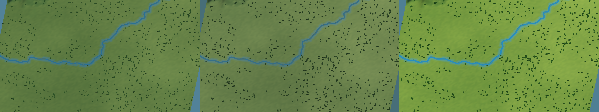
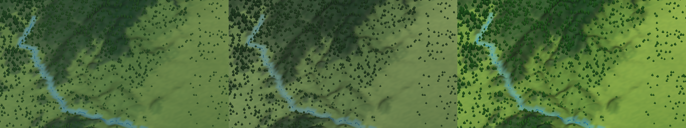
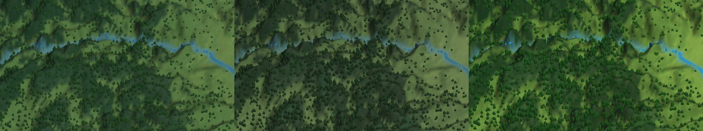

# STYLE CANDIDATE 视觉报告

## 样板与对比口径

| 样板 | Global Row/Column | WORLD Camera | REGION Camera | 用途 |
| --- | --- | --- | --- | --- |
| A 中原平原 | 1209 / 2148 | size 410, pitch 66, yaw -5 | size 31, pitch 58, yaw -10 | 平原、水系、地表单调风险 |
| B 山地河谷 | 1110 / 2090 | size 340, pitch 64, yaw -10 | size 25, pitch 55, yaw -16 | 山脊、谷地、坡面、河岸 |
| C 森林丘陵 | 1460 / 1970 | size 330, pitch 63, yaw 8 | size 24, pitch 54, yaw 12 | 林缘、疏密、丘陵与远近层次 |

三套 Style 只替换 Profile。DEM、Global Cell、河流中心线、森林密度输入、样板位置、Camera 行列/size/pitch/yaw、太阳方向基线完全一致。截图来自 `HanWorldArtDirectionLab` 的真实 Game View；Grid、Tile Border、Region Boundary、Cell ID 和背景贴图关闭。

## 核心三联图

## 评价

| 维度 | STYLE A | STYLE B | STYLE C |
| --- | --- | --- | --- |
| Geographic readability | PASS | PASS | PASS，最强 |
| Terrain relief | PASS，克制 | PASS，平衡 | PASS，最突出 |
| Historical atmosphere | PARTIAL | PASS，最强 | PARTIAL |
| Chinese art character | PARTIAL | PASS | PARTIAL |
| Natural realism | PASS，最强 | PASS | PARTIAL |
| Strategic readability | PASS | PASS | PASS，最强 |
| River quality | PARTIAL | PARTIAL | PARTIAL；最清楚 |
| Forest quality | PARTIAL | PARTIAL | PARTIAL |
| WORLD / REGION | PASS / PASS | PASS / PASS | PASS / PASS |
| Future city compatibility | PASS / NOT_PROVEN_IN_CITY | PASS / NOT_PROVEN_IN_CITY | PARTIAL / NOT_PROVEN_IN_CITY |

## 16项自审摘要

- STYLE A：已脱离 GIS Viewer；仍可见程序化树冠和 2km Terrain 痕迹；山体自然但层次最弱；平原最克制；河流与森林可读；空气透视成立；题材气质偏弱；不过度写实、卡通或水墨；未来城墙、人物和军队较易兼容；最大缺点是识别度不足。
- STYLE B：已脱离 GIS Viewer；仍有程序化资产限制；山脊/谷地和远近层次最协调；低饱和灰绿、墨绿、青灰水、暖光冷影形成中国历史气质；不是纯水墨；WORLD 可读、REGION 有空间感；未来洛阳 3D 建筑兼容性预计最好但尚未以城市实物证明；最大缺点是山林暗部偏重。
- STYLE C：地形、河流和森林分离最清楚，战略态势阅读最好；仍是同一真实 3D 世界且没有 Cell 棋盘；颜色最鲜、起伏最强但没有进入卡通；未来建筑可能需要降低局部饱和和夸张；最大缺点是鲜绿与视觉强度可能压过城市和人物。

## 仍未完成的美术

三套都是“方向候选”，不是最终商业美术。树种/季相/风动、泥/砂/砾河岸、深水与反射、微观草土岩材质、体积空气、天气、抗锯齿和城市实物兼容测试仍待用户先选择主方向。
