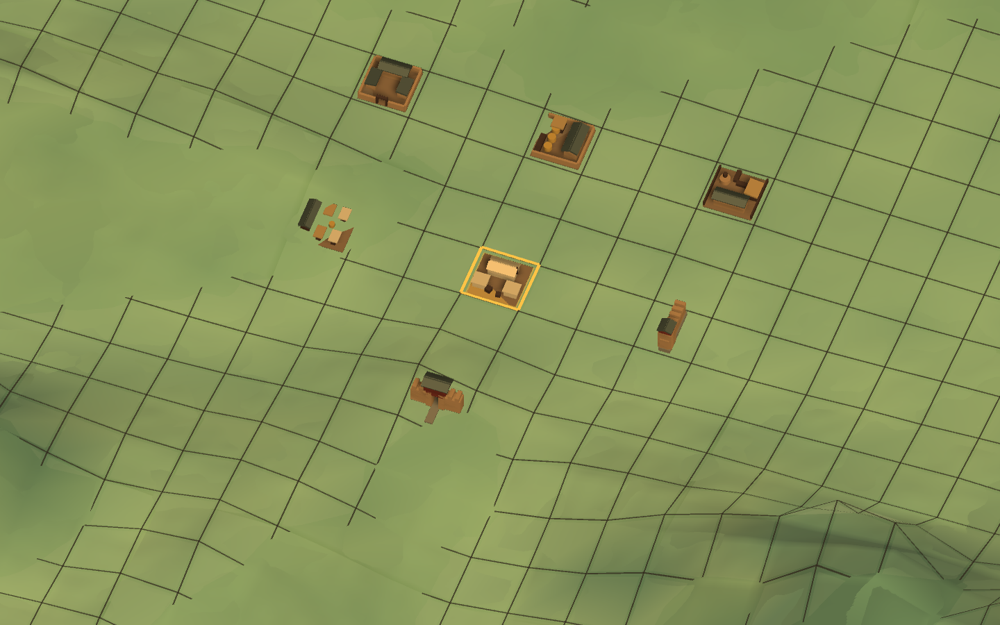

# 洛阳第一批可建设建筑模型套件 V1

状态：`IMPLEMENTED_TARGET_TESTS_PASSED_FORMAL_UNITY2022_VERIFICATION_BLOCKED`

本目录保存 `LUOYANG-BUILDABLE-FACILITY-MODEL-KIT-V1` 的执行报告、来源说明和视觉证据。

## 视觉方向

- 东汉中原通用建筑语汇；
- 半写实、中低模、战略微缩；
- 夯土、深色木构、灰绿色瓦、茅草与素色布；
- 官防建筑只使用克制的暗红木构；
- 不使用后世重檐宫殿化装饰、幻想建筑或现代医疗标志。

## 运行时边界

模型组合是 `Mandate.Presentation` 资产，可按正式 Cell 和 Runtime Binding 实例化；Facility、产权、
建设材料、工人、资金、时间与完工仍由 Domain/Simulation 既有事实决定。审查模式中的七个实例
仅用于表现验收，不是新建的洛阳世界设施。

## 来源与许可

- 建模方向参考项目内用户已接受的两张 OpenAI ImageGen 原创概念图；
- 三维组合由本项目代码和 Unity 内置基础几何原创生成；
- 未引入外部商业游戏资产、第三方模型或第三方贴图。

## 执行与验证

- 目录清单：7 个稳定 Model ID、90 个程序化模块、9 种共享材质；
- 运行时：七模型绑定七个互异正式 Global Cell，一格一个实例，无表现 SubCell；
- 测试：隔离 Unity 6000.5 兼容副本完成全脚本编译，目标与直接相关回归 11/11 通过；
- 正式 Unity 2022.3.62f3c1 与 Core Runner 因本机缺少对应 Editor/MSBuild 未执行，不能写成已通过；
- 本轮不包含最终 FBX、高模、烘焙贴图或 LOD Mesh。

## 视觉证据

