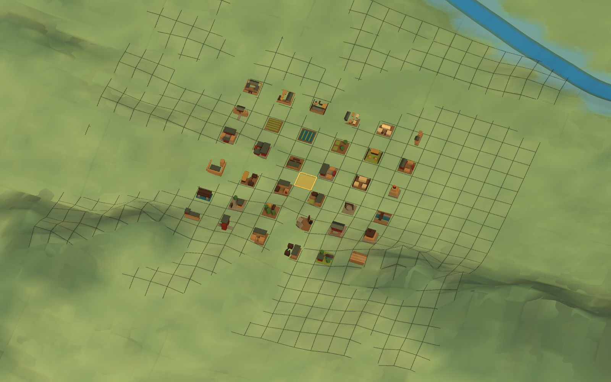

# 洛阳设施模型覆盖与A级历史建筑组合 V1

状态：`IMPLEMENTED_TARGET_VERIFICATION_PASSED_READY_FOR_USER_REVIEW`

本目录保存洛阳36项程序化模型目录、2,084项Facility显式绑定审计和实际Unity Game View证据。

## 口径

- 7项既有第一批模型保持稳定ID；
- 新增29项模型，覆盖农业、官署、宫殿、教育、军事、服务、公共、资源、礼制和线性基础设施；
- 2,084项开局Facility不生成第二套身份，模型只保存表现绑定；
- 全部内容为项目原创Unity基础几何组合，无第三方商业游戏素材；
- 当前仍是程序化3D V1，不是最终FBX、贴图烘焙或正式LOD美术。

## 视觉证据

Unity 2022.3.62f3c1 图形化 PlayMode 已生成 1600×1000 实际 Game View；目标测试通过 1/1，
36 个模型位于 36 个互异正式 Global Cell，切回 WORLD 后模型归零。

自动化目标验收已经通过，当前等待用户审图；该图仍是程序化战略微缩 V1，不代表最终 FBX、
烘焙贴图、正式 LOD、损毁状态或全城 Streaming 已完成。
