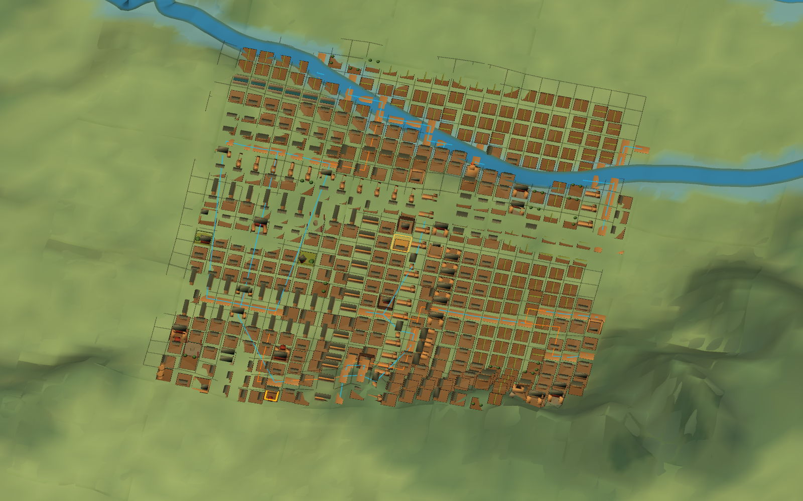

# 洛阳建筑选择、碰撞代理与道路通行图 V1 证据

正式任务书：
[`TASK_LUOYANG_FACILITY_SELECTION_COLLISION_AND_ROAD_NAVIGATION_V1.md`](../../TASK_LUOYANG_FACILITY_SELECTION_COLLISION_AND_ROAD_NAVIGATION_V1.md)

## 已验证结果

- 全城选择代理合同：2,084项；
- 最密CITY运行时BoxCollider触发器：549项；
- 道路/桥门通行节点：379项；
- 通行边：382条，其中严格道路边334、临时断点连接边28、桥门接入边20；
- 原始严格道路连通片：29；
- 选择代理不修改最终美术Prefab，不进入存档，不创建SubCell；
- 目标EditMode 3/3、图形PlayMode 1/1通过；
- 图形证据具有像素方差门禁，Null Graphics纯背景图不能通过。

## 图形证据

图中青色带为当前常驻窗口内的道路/桥门通行边，黄色边框为射线选中的具体Facility。斜向青色边可能
属于明确标记的临时断点连接，不表示已经考证的史实道路。

## 验证文件

- 最终统一编译：`tmp/skill-verification/compile-20260828-000940-123.out.log`；
- 最终统一核心：`tmp/skill-verification/core-tests-20260828-000956-290.out.log`；
- 最终统一EditMode：`tmp/unity-validation/unity-EditMode-20260828-000958-970.summary.json`；
- 图形PlayMode：`tmp/unity-validation/unity-PlayMode-20260828-000447-887.summary.json`。
- 既有全城构图图形回归：`tmp/unity-validation/unity-PlayMode-20260828-000846-087.summary.json`。

完整回归未由以上定向结果替代。城门开闭、实体阻挡、角色尺度NavMesh、桥梁损毁与道路史实细化仍是
后续任务。
