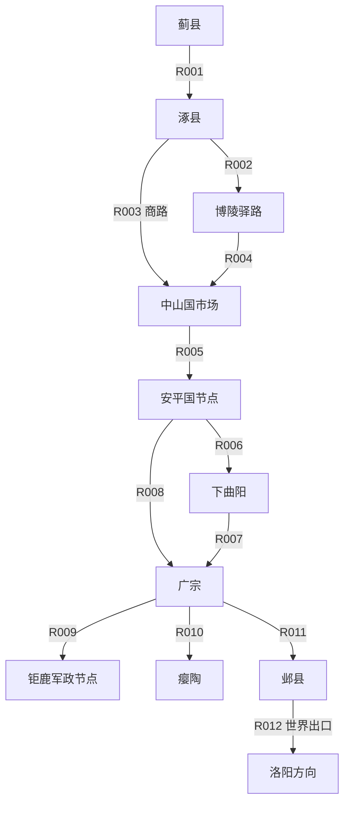

# 184年涿郡—广宗原型地图

## 1. 地图目标

首张地图不是全国地图的缩小版，而是一条可以验证核心玩法的历史走廊：

> 从幽州涿县的个人生活出发，经中山、安平进入钜鹿战区，最终接触广宗与下曲阳战事。

这条走廊能够同时承载：

- 刘备小集团募兵与邹靖官军任务；
- 张世平、苏双的北方贸易和军资投资；
- 太平道传播、告密、缉查与信众救助；
- 黄巾起事后的难民、粮价、伤病、征发和道路风险；
- 卢植、董卓、皇甫嵩先后影响广宗战局；
- 玩家家族留在故乡、随军迁移或转入商路的长期选择。

## 2. 地理口径

### 2.1 历史地名与地图坐标分离

数据中至少保存四组信息：

- `historical_name`：184年使用的地名。
- `administrative_parent_184`：184年的州、郡/国归属。
- `modern_reference`：用于考证的现代大致位置，不在游戏正文直接显示。
- `game_position`：为可玩性调整后的地图坐标。

现代地名只用于定位，不能据此假定古城址、河道和道路完全重合。

### 2.2 距离分级

当前所有距离均为**玩法估算V0.1**，不是考古测量结果：

- 短程：20—50公里，一至两天徒步。
- 中程：50—100公里，两至四天徒步。
- 长程：100—180公里，四至七天徒步。
- 超长程：180公里以上，应拆分为多个旅途节点。

基础日行能力采用：

| 队伍 | 正常道路 | 泥泞/战乱道路 | 主要限制 |
|---|---:|---:|---|
| 单人徒步 | 28公里 | 16公里 | 体力、食水 |
| 骑马信使 | 65公里 | 35公里 | 换马、驿站权限 |
| 小型商队 | 24公里 | 14公里 | 车况、货物、关卡 |
| 百人队伍 | 20公里 | 12公里 | 营地、粮秣、纪律 |
| 大军 | 16公里 | 8公里 | 辎重、道路容量、敌情 |

这些数值是游戏平衡初值，后续通过原型测试调整。

## 3. 第一层：主要地点

| ID | 历史地点 | 184年归属 | 类型 | 地图作用 | 首版状态 |
|---|---|---|---|---|---|
| L001 | 涿县 | 幽州·涿郡 | 县城/出生地 | 刘备集团、募兵、家族生活、商队出发 | 完整可进入 |
| L002 | 蓟县 | 幽州·广阳郡 | 州域中心/大城 | 幽州军政、北方情报、远程市场 | 简化可进入 |
| L003 | 广阳战区 | 幽州·广阳郡 | 战区 | 黄巾杀刺史、太守后的失序区域 | 野外事件区 |
| L004 | 中山国节点 | 冀州·中山国 | 郡国中心/市场 | 张世平、苏双贸易来源，买马与融资 | 完整市场 |
| L005 | 博陵节点 | 冀州·博陵地区 | 驿路/县城 | 涿郡与中山、安平间的中继 | 简化驿站 |
| L006 | 安平国节点 | 冀州·安平国 | 郡国中心 | 官府文书、征募、宗室受乱影响 | 简化可进入 |
| L007 | 下曲阳 | 冀州·钜鹿郡 | 县城/战场 | 张宝部最终战场，晚期主线 | 完整战场 |
| L008 | 广宗 | 冀州·钜鹿郡 | 县城/核心战场 | 张角、张梁据守；卢植围城 | 完整战场 |
| L009 | 钜鹿郡治节点 | 冀州·钜鹿郡 | 郡级军政节点 | 郭典、地方军需、战区行政 | 简化可进入 |
| L010 | 瘿陶 | 冀州·钜鹿郡 | 县城/道路节点 | 广宗以西北的补给与后续黑山线 | 驿站级 |
| L011 | 邺县 | 冀州·魏郡 | 大城/后勤基地 | 冀州南部市场、官军后勤与政治消息 | 简化大市场 |
| L012 | 黄河—洛阳出口 | 司隶方向 | 世界出口 | 诏令、援军、左丰与槛车事件来源 | 不可直接进入 |

“中山国节点”“安平国节点”等暂为区域级代理点。确定可靠古城址与原型范围后，
再决定采用卢奴、信都等具体治所名称，避免在考证不足时制造伪精确。

## 4. 第二层：附属节点

| ID | 名称 | 类型 | 所属主要地点 | 玩法 |
|---|---|---|---|---|
| S001 | 楼桑乡里 | 乡里 | 涿县 | 刘备故里叙事、农户与宗族生活 |
| S002 | 涿县马市 | 市集 | 涿县 | 马匹、皮革、军需、商人投资 |
| S003 | 涿县县寺 | 官署 | 涿县 | 户籍、赋税、征募、缉捕 |
| S004 | 范阳驿路节点 | 驿站 | 涿县南路 | 换马、邮书、盘查、住宿 |
| S005 | 易水渡口 | 渡口 | 涿郡南缘 | 水位、渡资、封锁、走私 |
| S006 | 中山马商行 | 商号 | 中山国节点 | 张世平、苏双及生成商人网络 |
| S007 | 中山药材市 | 市集 | 中山国节点 | 医者、疫病与军队采购 |
| S008 | 安平宗室庄园 | 庄园 | 安平国节点 | 宗室赎还、豪强与佃户关系 |
| S009 | 赵魏太平道坛点 | 秘密组织 | 广宗外围 | 治病、布道、联络、告密 |
| S010 | 卢植军营 | 军营 | 广宗外围 | 官军任务、工事、军纪 |
| S011 | 广宗围壕 | 战场设施 | 广宗 | 围城、云梯、夜袭、逃亡 |
| S012 | 黄巾营地 | 军营/聚落 | 广宗 | 信众、家属、伤病与内部派系 |
| S013 | 下曲阳河岸营地 | 战场设施 | 下曲阳 | 渡河、溃兵、尸体与疫病 |
| S014 | 钜鹿粮仓 | 仓储 | 钜鹿郡治节点 | 征粮、护运、贪腐、平粜 |
| S015 | 瘿陶山道出口 | 山道 | 瘿陶 | 盗匪、逃兵、后续黑山势力伏笔 |
| S016 | 邺城官仓 | 仓储 | 邺县 | 大宗粮草和军需结算 |
| S017 | 邺城客舍区 | 城区 | 邺县 | 跨区商人、传闻、雇佣人员 |
| S018 | 洛阳军报站 | 世界接口 | 黄河—洛阳出口 | 皇帝诏令、换将、封赏与问责 |

## 5. 首版道路网络

| 路线ID | 起点—终点 | 估算里程 | 徒步基准 | 路线性质 | 184年风险 |
|---|---|---:|---:|---|---|
| R001 | 蓟县—涿县 | 约80公里 | 3天 | 幽州主干道 | 中：黄巾与官军盘查 |
| R002 | 涿县—博陵节点 | 约95公里 | 4天 | 南下驿路 | 中：征发、逃兵 |
| R003 | 涿县—中山国节点 | 约140公里 | 5天 | 商贸路线 | 中：马贼、货税 |
| R004 | 博陵—中山国节点 | 约65公里 | 3天 | 区域道路 | 低至中 |
| R005 | 中山—安平节点 | 约90公里 | 4天 | 冀州横向商路 | 中：流民与封锁 |
| R006 | 安平—下曲阳 | 约80公里 | 3天 | 战区补给路 | 高 |
| R007 | 下曲阳—广宗 | 约150公里 | 6天 | 钜鹿战区纵路 | 极高 |
| R008 | 安平—广宗 | 约170公里 | 7天 | 官军长程补给路 | 高 |
| R009 | 广宗—钜鹿郡治节点 | 约55公里 | 2天 | 战区短路 | 极高 |
| R010 | 广宗—瘿陶 | 约70公里 | 3天 | 战区侧路 | 高 |
| R011 | 广宗—邺县 | 约110公里 | 4天 | 南部补给路 | 高 |
| R012 | 邺县—洛阳出口 | 约190公里以上 | 分段 | 国家主干方向 | 中至高 |

里程只用于确定玩法节奏，全部标记为`provisional=true`。尤其广宗、下曲阳及钜鹿郡治的
古址对应存在复杂沿革，后续必须逐点核验。

## 6. 路线结构

这不是现代道路复原图，而是游戏的第一版拓扑。历史考证负责修正节点身份和相对位置，
玩法测试负责修正节点数量与行程长度，两者必须分别记录。

## 7. 旅行系统

### 7.1 每日结算

每次旅行按日结算：

1. 天候与道路状态；
2. 队伍速度与粮草消耗；
3. 官府、军队或地方组织的盘查；
4. 商业、疾病、难民、盗匪或人物事件；
5. 当日扎营、投宿或继续赶路；
6. 家庭和世界在玩家离开期间继续运行。

### 7.2 风险不是随机扣血

风险分为六类：

- **治安**：盗匪、溃兵、绑架、偷窃；
- **军事**：封路、征用、误认敌军、战斗；
- **官府**：验传、查户籍、关税、通缉；
- **自然**：暴雨、河水、寒冷、迷路；
- **健康**：疫病、伤口恶化、食水问题；
- **经济**：货损、畜力死亡、价格变化、违约。

玩家可以通过身份、声望、通行文书、向导、护卫、医术和情报降低不同风险。

### 7.3 身份差异

| 身份 | 旅行优势 | 旅行弱点 | 专属机会 |
|---|---|---|---|
| 军人 | 可进入军营、获得护送 | 被征调、受军纪约束 | 侦察、押运、增援 |
| 县吏/士人 | 文书与驿站权限 | 政权变化时容易被追责 | 传檄、核验、调解 |
| 商人 | 商路情报、车马资源 | 货物成为抢夺和征用目标 | 套利、军资、信用 |
| 侠士 | 小队机动、绕行 | 缺少正式身份 | 护送、救人、缉盗 |
| 医者 | 疫区和伤营入口 | 药材负重、感染风险 | 救治、采药、检疫 |
| 农户 | 熟悉本地乡路 | 离乡后资源与身份弱 | 带路、藏粮、安置 |
| 工匠 | 修车、修械 | 工具和材料负重 | 军需、桥梁、营造 |
| 宗教人士 | 信众网络和隐蔽投宿 | 官府镇压风险 | 布道、救济、秘密联络 |
| 密探 | 假身份、情报路线 | 暴露后惩罚严重 | 截信、渗透、策反 |

## 8. 战争与个人地图的连接

大战不是独立副本。广宗战场由以下世界对象组成：

- 军营、围壕、城门、粮道、伤兵营和逃亡路线；
- 每支军队的兵力、士气、粮秣、疾病、统帅关系；
- 周边县城的人口、粮价、治安与官府控制；
- 玩家可以实际改变的侦察、粮运、医疗、工事和小规模战斗。

当战争进入正式会战时，保留三国志式部队战争层；个人角色则以所属部队、职位和任务
进入战场。商人或医者即使不直接指挥部队，也能通过军资和伤员恢复影响战果。

## 9. 首版开发范围

### 必须做

- 6个主要可进入地点：涿县、中山、安平、下曲阳、广宗、邺县。
- 约18个附属节点。
- 12条路线及每日旅行结算。
- 春、夏、秋、冬与战争状态对道路的修正。
- 玩家离开故乡后，家庭仍按日推进。

### 暂缓

- 全国无缝地形；
- 精确复原每个汉代县界；
- 所有河流的实时水文；
- 可视化万人同屏；
- 直接表现洛阳内部地图。

## 10. 考证待办

- 核验184年涿郡、广阳郡、中山国、安平国、钜鹿郡、魏郡的县级隶属。
- 为每个主要节点记录至少一条正史地理志来源和一条现代历史地理研究来源。
- 核验广宗、下曲阳、瘿陶和钜鹿郡治在184年的相对位置与古城址争议。
- 根据古河道、驿路和地形修订R001—R012。
- 将考证坐标与游戏坐标分别存储，禁止互相覆盖。

